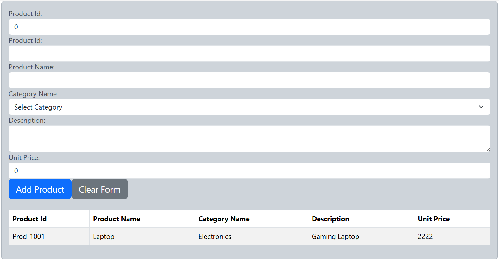

# What is React Component?
In React, a component is the fundamental building block of the user interface. Think of it like a reusable chunk of code that represents part of the UI—whether it’s a button, a form, a sidebar, or even an entire page.

- A component is a self-contained piece of UI logic written in JavaScript (or TypeScript), usually combining:
    - Structure (HTML via JSX)
    - Style (CSS or inline styles)
    - Behavior (event handling, state management)

# Why Use Components?
    - Reusability: Write once, use in many places
    - Modularity: Break the UI into logical parts
    - Maintainability: Easier to manage complex UIs

# What is props in React?

In React, props (short for properties) are the mechanism by which data is passed from one component to another—specifically from a parent component to a child component. They’re a key part of React’s component-based architecture.

# What Props Do

- Props let components be:
    - Reusable: You can create a generic component and customize it by passing different props.
    - Dynamic: Components can change behavior or appearance based on the values of props.

# What is State in React?
State refers to data or values that change over time and affect what gets rendered on the screen.

# Key Characteristics of State

- Mutable: Unlike props (which are read-only), state can be changed.

- Triggers Re-render: Updating state causes React to re-render the component.

- Component-specific: Each component manages its own state unless you lift it up or use context.

- Declaring State

````typescript
import React, {useState} from 'react'
const MyComponent=()=>{
    const [x,setX] = useState<number>(0)
};

````

# State, Best Properties
- Never mutate state directly Always use the setter function
- Group related data Use objects or arrays in state when managing structured or grouped data


# Props vs State in Component

| Feature     | Props                | State                  |
|-------------|----------------------|------------------------|
| Purpose     | Pass data to component | Manage internal data |
| Read/Write  | Read-only            | Read and write         |
| Defined by  | Parent               | Component itself       |


# Defining the Props
- Create a new TypeScript file with declaration using by any of the following:
    - class, interface, type
    
````typescript
export type Props = {
    info:string
}

export type SelectData = {
   dataSource: string[];
   propertyName?: string; // Optional property for additional data
   selectedValue?: (value:string) => void; 
};


export class ProductInfo {
     constructor(
        public ProductId: string,
        public ProductName: string,
        public CategoryName: string,
        public Description: string,
        public UnitPrice: number,
        public ProductRecordId: number
     ){}
}
````

# Creating Component for using the props to pass data acess components
    - The MessageParentComponent, uses the MessageChildComponent as its child and pass the IMessage as props to it with all of its properties. The MessageChildComponent, emits 'onSelectValue' event to MessageParentComponent.

````typescript
import React from "react";
import { IMessage } from "../dataschema/IMessage";  

const MessageParentComponent =()=>{
  const message:IMessage = {
    id:101,
    content:"Hello from Parent",
    characters:["James","Ethan","Indiana", "Jack", "Jason"]
  }
  const showSelectedValue = (val:string) => {
    alert(`Selected character: ${val}`);
  }
  return (
    <div className="container alert-info">
        <MessageChildComponent id={message.id} content={message.content} characters={message.characters}
        onSelectValue={showSelectedValue}
        ></MessageChildComponent>
    </div>
  )
}

const MessageChildComponent =(props:IMessage)=>{
    const onSelectionChange=(evt:any)=>{
        if(props.onSelectValue){
            props.onSelectValue(evt.target.value);
        }
    }
    return (
        <div className="container alert-info">
            <strong>
                {props.id} - {props.content}
            </strong>
            <br />
            <select className="form-select" name="dd"
                onChange={onSelectionChange}
            >
                {props.characters.map((character, index) => (
                    <option key={index} value={character}>
                        {character}
                    </option>
                ))}
            </select>
        </div>
    )
}


export default MessageParentComponent;
````

# Creating the Component using state

````typescript
import React, {useState} from "react";
import { ProductInfo, SelectData } from "../dataschema/props";

const ProductComponent=()=>{
    const [product,setProduct] = useState<ProductInfo>(
        new ProductInfo("", "", "", "", 0, 0));
    const [products,setProducts] = useState<ProductInfo[]>([]);
    const categories = ["Electronics", "Books", "Clothing", "Sports"];
    const addProduct=()=>{
        setProducts([...products, {...product}]);
        setProduct(new ProductInfo("", "", "", "", 0, 0)); // Reset the form
    }
    const clearForm=()=>{
        setProduct(new ProductInfo("", "", "", "", 0, 0));
    }
    return (
       <div className="container alert alert-dark">
         <div className="form-group">
             <label htmlFor="ProductRecordId">Product Id:</label>
             <input type="text" className="form-control" id="ProductRecordId"
                value={product.ProductRecordId}
                onChange={(e) => setProduct({...product, ProductRecordId: parseInt(e.target.value)})}></input>
        </div>
         <div className="form-group">
             <label htmlFor="ProductId">Product Id:</label>
             <input type="text" className="form-control" id="ProductId"
                value={product.ProductId}
                onChange={(e) => setProduct({...product, ProductId: e.target.value})}></input>
        </div>
        <div className="form-group">
            <label htmlFor="ProductName">Product Name:</label>
            <input type="text" className="form-control" id="ProductName"
            value={product.ProductName}
            onChange={(e) => setProduct({...product, ProductName: e.target.value})}></input>
        </div>
        <div className="form-group">
            <label htmlFor="CategoryName">Category Name:</label>
            <select className="form-select" id="CategoryName"
                value={product.CategoryName}
                onChange={(e) => setProduct({...product, CategoryName: e.target.value})}>
                    <option value="">Select Category</option>
                {categories.map((category, index) => (
                    <option key={index} value={category}>
                        {category}
                    </option>
                ))}
            </select>
        </div>
        <div className="form-group">
            <label htmlFor="Description">Description:</label>
            <textarea  className="form-control" id="Description"
            value={product.Description}
            onChange={(e) => setProduct({...product, Description: e.target.value})}></textarea>
        </div>
        <div className="form-group">
            <label htmlFor="UnitPrice">Unit Price:</label>
            <input type="number" className="form-control" id="UnitPrice"
            value={product.UnitPrice}
            onChange={(e) => setProduct({...product, UnitPrice: parseFloat(e.target.value)})}></input>
       </div>
       <div className="btn-group-lg">
              <button className="btn btn-primary" onClick={addProduct}>Add Product</button>
              <button className="btn btn-secondary" onClick={clearForm}>Clear Form</button> 
       </div>
       <br/>
       <div className="table-responsive">
              <table className="table table-bordered table-striped">
                <thead>
                     <tr>
                          <th>Product Id</th>
                          <th>Product Name</th>
                          <th>Category Name</th>
                          <th>Description</th>
                          <th>Unit Price</th>
                     </tr>
                </thead>
                <tbody>
                     {products.map((prod, index) => (
                          <tr key={index}>
                            <td>{prod.ProductId}</td>
                            <td>{prod.ProductName}</td>
                            <td>{prod.CategoryName}</td>
                            <td>{prod.Description}</td>
                            <td>{prod.UnitPrice}</td>
                          </tr>
                     ))}
                </tbody>
              </table>
       </div>
       </div>
    );

};
export default ProductComponent;

````
- The Result is as follows:


